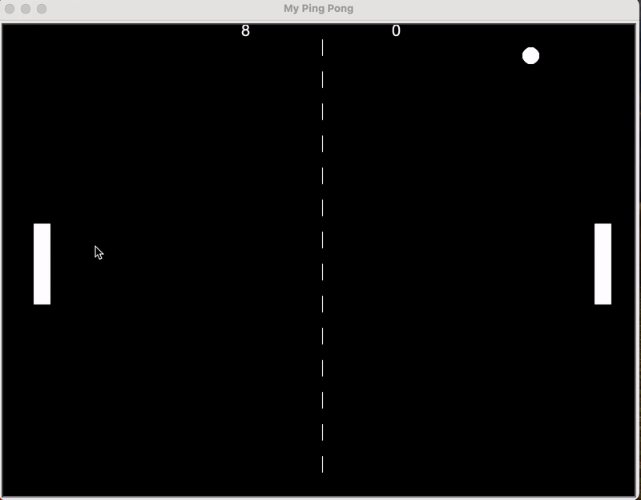

# Game requirments breakdown

1. Screen setup
2. Create and move a bat in a single direction
3. Create another bat
4. Create the ball and make it to move
5. Detect collision with wall and bounce
6. Detect collision with bat
7. Detect when bat misses
8. Track and report score using a scoreboard

