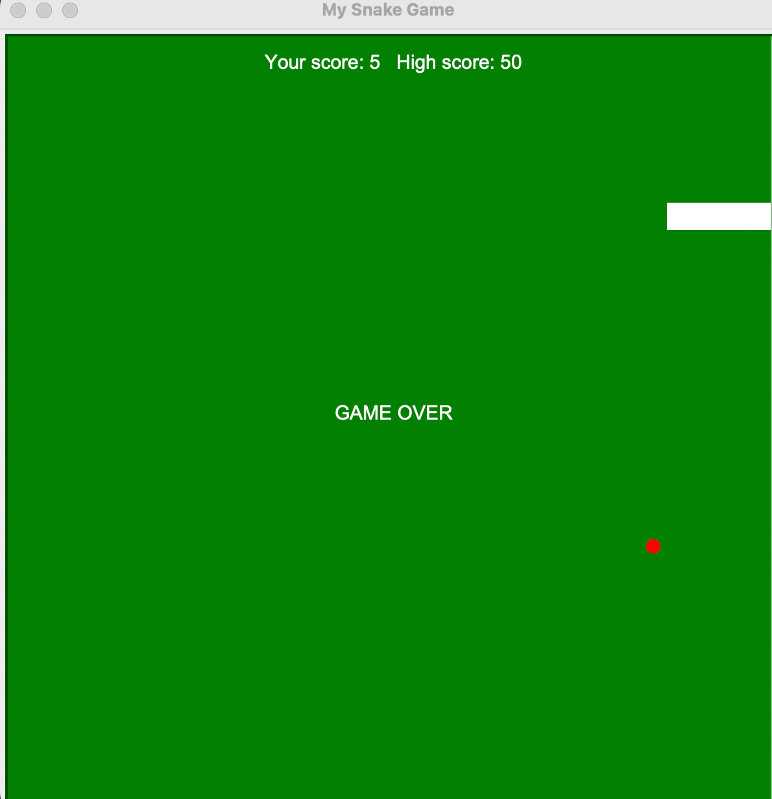

# Game requirments breakdown

1. Screen setup and creation of the snake segment(body)
2. Animating the snake segement on screen (i.e. getting it to move)
3. Control Snake direction with keypad
4. Detecting Collision with food - this increases snake size
5. Keeping track of score with a score board
6. Detecting Collision with wall
7. Detecting Collision with tail

